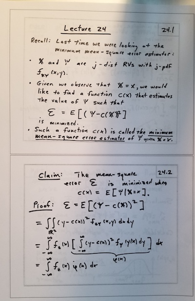
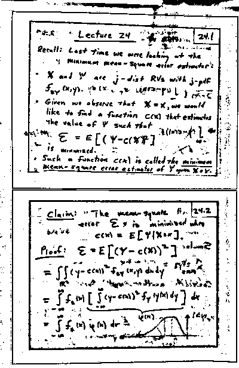
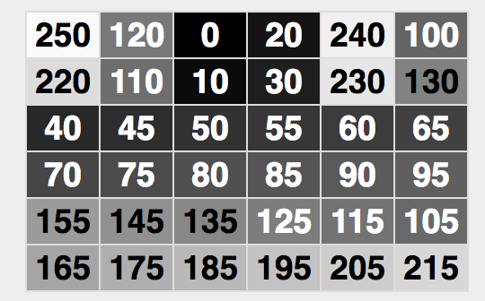

# Image Processing (Adaptive Thresholding) (A)

## This is an assignment
In this assignment you will be implementing an important image processing algorithm which is used in  scanned document processing, OCR, image segmentation, etc

<strong>Please read the entire file and the comments in the files provided before you ask any question.</strong><br>
<strong>You should write your own Makefile to test the code.</strong>


# Learning Goals
You will learn to
* Opening/Writing image files
* Working with Images
* Understand the color scale in images

# Description of Assignment
This assignment requires you to do the following :
1. Open the colored BMP image
2. Convert the colored image to grayscale
3. Run Adaptive Thresholding algorithm on grayscale image
4. Save the new image in BMP format

## Adaptive Thresholding

Let suppose we have an image :




You can see that there is shadow coming on the image. Now, to remove that shadow we will use Adaptive Thresholding technique. This algorithm sets Pixels brighter than some threshold white. The rest are set to black. The key question becomes: What should be the value of this threshold?


There are many good ways to decide the threshold. For this assignment, we will keep it simple:
```
For a neighborhood radius r, a pixel at (x0, y0) shall be white if and only if its intensity 
is greater than or equal to the average intensity of all pixels in the (2r + 1) × (2r + 1) neighborhood 
surrounding that pixel. That neighborhood shall consist of all pixels at (xi, yi), such 
that |xi - x0| ≤ r, including the current pixel being thresholded. Pixels that are not white 
shall be black. In calculating the threshold, do not include pixels that are beyond the boundaries 
of the image. This means that for such edge pixels, the neighborhood will be smaller.

```
P.S. - Please note that in image and 2d arrays: y0 is row and x0 is column.

and the resultant file is as follows :




Example: Suppose we are doing adaptive thresholding for the following 6x6 image with `radius=1`, and one more variable `epsilon=2`. The role of `epsilon` is basically to take care of the precision/rounding errors.



The pixel at (row=3, col=2)(first pixel at row=0,col=0) currently has intensity value of 80. The neighborhood (radius=1) consists of pixels having intensity values 45, 50, 55, 75, 80, 85, 145, 135, and 125. The average of those is 88⅓. Since 80 ≤ (88⅓-2) (epsilon=2), the pixel at (col=2, row=3) shall be black.

Always calculate the threshold based on only the values in the input image.

Hint: Do not modify the input image in your AdaptiveThresholding function.

# Functions you need to complete
In this exercise, you have to complete six functions - `BMP_Open`, `Is_BMPHeader_Valid`,`BMP_Write`, `BMP_Free` in `bmpimage.c`;`ImgToGray`, `AdaptiveThresholding` in `bmpfunc.c`; and `main()` in `pa16.c`.
**Do not hardcode the name of the files in your code**

1. `BMP_Open` -  This function takes the name of the file as input, opens up a file. Checks whether the file has right `BMP` header by calling `Is_BMPHeader_Valid` function. If everything is alright, then stores the value of pixels in the `data` . Finally returns BMPImage\* .
2. `Is_BMPHeader_Valid` - Checks whether the input file has right `BMP` header. You can refer to `Intermediate C Programming` to look for the correct checks for the header.
3. `BMP_Write` -  this function writes the output as `BMP` file. You should first write `BMP` header into the file and then you should write the BMP Image data into it.
4. `BMP_Free` - Frees up all the memory allocated for the image.
5. `ImgToGray` - This function takes input as the `BMP` image and then converts the image to `grayscale` (24-bit image with red=blue=green) by setting the red, blue, and green components of each pixel to the value obtained from calling `RGB2Gray` function. The output image should have red=blue=green for all pixels. If this function fails, print `"Error converting to Gray image\n"` and return `EXIT_FAILURE`.
6. `AdaptiveThresholding` - Convert the given image to monochrome (black(value = 0) & white(value = 255)) using the adaptive threshold algorithm described above. If this function fails return `NULL` and in the main function print `"Error in Adaptive Gray image\n"` and return `EXIT_FAILURE`.
7. `main()` - In this assignment, your main function has the following the specifications.
  1. if the arguments != 5 then print "Wrong arguments\n" and return
  2. 1st input name of the input file image. If opening up of this file fails print `Error opening BMP file`, and return `EXIT_FAILURE`.
  3. 2nd input output image file name.
  4. 3rd input is the value of the radius needed for Adaptive threshold.
  5. 4th input is the value of epsilon. If 3rd or 4th input fails, print "Wrong inputs\n" and return `EXIT_FAILURE`.
  8. if file write fails, free memory and return EXIT_FAILURE

### Function already given to you :
**DO NOT modify this function**

`RGB2Gray` : this function takes red, green and blue value of a pixel as input and returns the gray value i.e. a number between 0-255

---------------------
# Testing your code
Following are the files we provide:
1. `pa16.c` - main file for this assignment.
2. `pa16.h` - Header file of the main file .
4. `bmpimage.h` - Header file, which has definition for the functions and structures you need in this assignment. Do not modify this file.
5. `bmpimage.c` - These contains the functions related to working with BMP images.
6. `bmpfunc.h` - Header file, which has definition for the functions you need in this assignment. Do not modify this file.
7. `bmpfunc.c` - Define your functions in this file. You can use any helper function you need but do not put them in the header file. Do not modify the functions that we have given you.
8. `expectedImages/` - This directory contains the expected output as generated by the commands shown
	1. `expectedRV.bmp` - ./pa16 exampleImages/RV.bmp expectedImages/expectedRV.bmp 5 2
	2. `expectedRV2.bmp` - ./pa16 exampleImages/RV2.bmp expectedImages/expectedRV2.bmp 3 2
	3. `expectedCondProb.bmp` - ./pa16 exampleImages/CondProb.bmp expectedImages/expectedCondProb.bmp 1 2


# Checking for memory errors
You should also run ./pa16 with arguments under valgrind. To do that, you have to use, for example, the following command:
```
valgrind --tool=memcheck --verbose --leak-check=full --log-file=valgrind.log ./pa16 exampleImages/RV2.bmp expectedImages/expectedRV2.bmp 3 2
```

Note that you should use other input arguments to extensively test your function. If you follow the instructions and keep the malloc and free functions in the right place, you should not have memory problems in this assignment.


# Submitting Your code
** This is a programming assignment, so you would have to submit the code on Blackboard.**

The command to create zip file is as follows:
```

zip HW16.zip pa16.c bmpfunc.c bmpimage.c

```
<strong>You will not get any credits if the submitted file is not zipped</strong>

The **only** way to submit homework is through Blackboard.

The instructor will **never** accept any requestion for exception "*my
submission is only one minute late*".  It is your responsibility to
meet the deadline.  You are strongly encouraged to submit at least ten
minutes before the deadline because submission may take time.

If there is a campus-wide problem (such as network outage or the
Blackboard server is down), the deadline will be extended for the
entire class. If the problem is specific to yourself (for example,
your computer crashes), the deadline will not be extended for
you.

**DO NOT** send your code by email. Your code will not be graded
  if it is sent by email.

The teaching staff is strictly prohibited to look at files on your
computer (or your Purdue account) for grading. Thus, **NEVER** say "I
finished before the deadline but I forgot to submit".  **NEVER** say "I have
not made any change after the submission deadline." because the
teaching staff is not allowed to look at your files that have not been
submitted through Blackboard.


# Grading
If your program has any compilation error or warning (remember to use
`gcc -std=c99 -g -Wall -Wshadow --pedantic -Wvla -Werror`), you will
receive zero in this assignment.

In absolutely no circumstance can the teaching staff modify your
program for grading.  You cannot say, "If you change this, my program
works." If your program misses a semicolon and cannot compile, you
will receive zero.  Your score depends on what is submitted, nothing
else.

**The grading test cases will be made available along with the grades**
